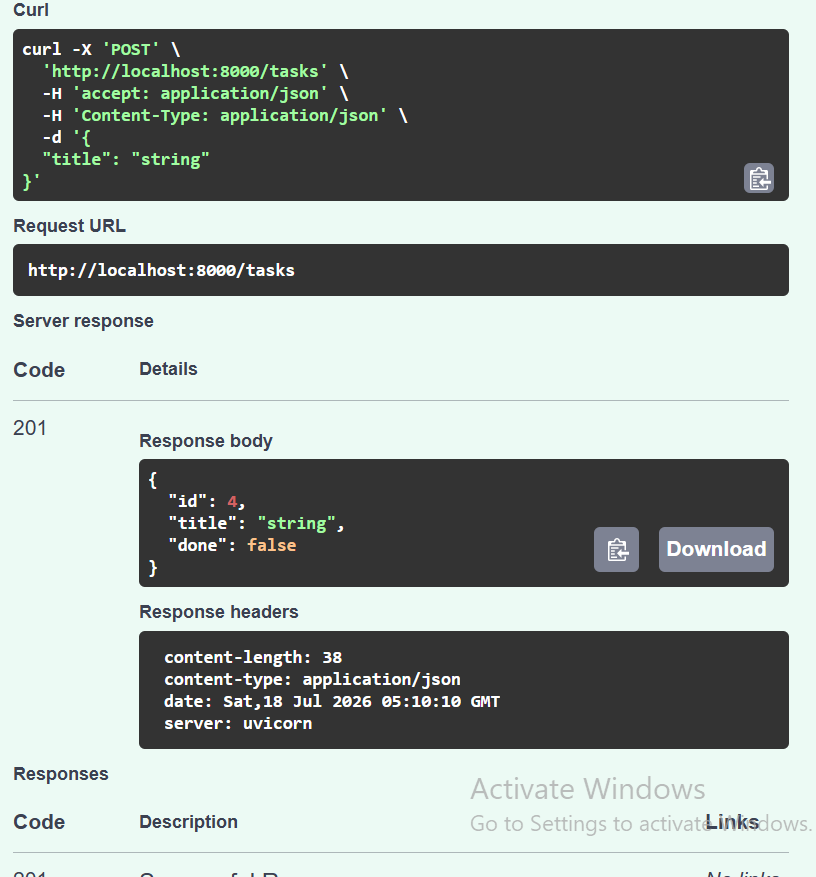

# Task API

A simple CRUD API for managing a to-do list, built with FastAPI as part of the FlyRank Week 2 backend assignment. Tasks are stored in memory (no database) - data resets whenever the server restarts.

## How to run

1. Clone this repo and enter the folder:

   git clone https://github.com/wisdomchaindustry-cloud/task-api.git
   cd task-api

2. Create and activate a virtual environment:

   python -m venv venv
   venv\Scripts\activate      (Windows)
   source venv/bin/activate   (Mac/Linux)

3. Install dependencies:

   pip install -r requirements.txt

4. Run the server:

   uvicorn main:app --reload

5. Visit http://localhost:8000/docs for interactive Swagger documentation.

## Endpoints

| Method | Path | Description |
|---|---|---|
| GET | / | API info |
| GET | /health | Health check |
| GET | /tasks | List all tasks |
| GET | /tasks/{task_id} | Get a single task |
| POST | /tasks | Create a new task |
| PUT | /tasks/{task_id} | Update a task |
| DELETE | /tasks/{task_id} | Delete a task |

## Example request

curl -i http://localhost:8000/tasks/1

HTTP/1.1 200 OK
content-type: application/json

{"id":1,"title":"Buy milk","done":false}

## Swagger UI

Full CRUD cycle tested via /docs "Try it out": Create, Read, Update, Delete all confirmed working with correct status codes (201, 200, 200, 204).



## The mortality experiment

I created a 4th task ("This task should disappear"), confirmed it existed via GET /tasks, then stopped the server (Ctrl+C) and restarted it (uvicorn main:app --reload). After restarting, GET /tasks showed only the original 3 seed tasks - the 4th task was gone. This happens because the task list lives only in the server's RAM as a Python variable; nothing was ever written to disk, so restarting the process wipes it clean and re-runs the hardcoded starting list from the top of the file.

## AI vs me

**Prompt used (first attempt):**

Build a to-do list API using FastAPI. It should have these endpoints:
- GET / → returns 200
- GET /health → returns 200
- GET /tasks → returns the whole list, status 200
- GET /tasks/{id} → returns a single task by id, status 200. If the id doesn't exist, return 404 with a JSON error like {"detail": "Task 99 not found"}
- POST /tasks → accepts JSON with a title (string). The server assigns the id, sets done to false, returns status 201. If the title is missing or empty, return 400 with {"error": "title is required"}
- PUT /tasks/{id} → accepts id, title, and done (true/false). Same validation and 404 rules as above. Returns status 200 if successful.
- DELETE /tasks/{id} → returns status 204 if successful. If the id doesn't exist, return 404 with {"detail": "Task 2 not found"}

Three example tasks should exist in memory when the server starts. No database.

**Result:** Every checkpoint passed on the first try — all status codes (200, 201, 204, 400, 404) and error JSON shapes matched exactly.

**What the AI did better:** It handled the missing/empty-title validation without needing a custom global exception handler. By making `title` optional in the Pydantic model and checking it manually, it got a precise `400` response directly — I had to build a separate exception handler in my own code to override FastAPI's default `422` for the same case.

**What it got wrong or ignored:** Nothing broke my checkpoints, but the AI invented its own JSON shape for `GET /` (`{"message": "To-Do List API"}`) since I never specified one — a silent decision filling a real gap in my prompt.

**What my prompt forgot to specify:** The exact JSON content of `GET /` and `GET /health` beyond their status codes, and any specific seed task titles.

**The rematch:** I added one sentence specifying the exact JSON for `GET /`. The regenerated version matched my own root endpoint's output exactly — proof that a more precise prompt produces a more precise result.


Claim offer


Pasted text.txt
Document

This is it


Excellent! 🎉 Congratulations! This shows that your API is working correctly with SQLite.

Let's analyze your result like a backend engineer.

Your GET /tasks response is:

[
  {
    "id": 1,
    "title": "Learn SQL",
    "done": false
  },
  {
    "id": 2,
    "title": "Complete FlyRank Week 2 Assignment",
    "done": false
  }
]
What this tells us
✅ Your POST /tasks endpoint successfully inserted new tasks into the SQLite database.

✅ Your GET /tasks endpoint is reading directly from the database.

✅ The deleted sample tasks did not come back, which proves your data is persistent and not coming from an in-memory list.

✅ Your CRUD API is now using SQLite instead of a Python list.

This means you've successfully demonstrated one of the main goals of the assignment: replacing the storage layer while keeping the API the same.

Next: Test the Update Endpoint (PUT)
Let's verify that updating a task also works.

Step 1
In Swagger, expand:

PUT /tasks/{task_id}
Click Try it out.

Step 2
For the task_id, enter:

1
Step 3
In the request body, replace the example with:

{
  "title": "Learn SQLModel",
  "done": true
}
Step 4
Click Execute.

You should receive something similar to:

{
  "id": 1,
  "title": "Learn SQLModel",
  "done": true
}
Step 5
Now run:

GET /tasks
You should see:

[
  {
    "id": 1,
    "title": "Learn SQLModel",
    "done": true
  },
  {
    "id": 2,
    "title": "Complete FlyRank Week 2 Assignment",
    "done": false
  }
]
This confirms the update was saved to the database.

Final Test: Delete a Task
After that, test the delete endpoint.

Expand:

DELETE /tasks/{task_id}
Click Try it out.

Enter:

2
Click Execute.

You should receive a 204 No Content response.

Finally, run:

GET /tasks
Expected response:

[
  {
    "id": 1,
    "title": "Learn SQLModel",
    "done": true
  }
]
Where You Are in the Assignment
Stage	Status
Stage 0 – Create SQLite database	✅ Complete
Stage 1 – Read from database	✅ Complete
Stage 2 – Insert into database	✅ Complete
Stage 3 – Update and delete using SQL	Nearly complete (just test PUT and DELETE)
Stage 4 – Learn SQL with DB Browser	Nearly complete (finish the remaining SQL queries if you haven't already)
Stage 5 – Update README	⏳ Next
My recommendation
Once you've tested PUT and DELETE, don't commit immediately. Send me your final GET /tasks response after those tests. I'll review everything to make sure your API fully meets the FlyRank assignment requirements, and then I'll help you write a professional README.md for Stage 5 that will make your GitHub repository submission stand out.


Response body
Download
[
  {
    "id": 1,
    "title": "Learn SQLModel",
    "done": true
  }
]
Response headers
 content-length: 47 
 content-type: application/json 
 date: Wed,29 Jul 2026 11:05:45 GMT 
 server: uvicorn Final get task after deleting task 2

Excellent work! 🎉 Based on everything you've shown me over the last two days, I can confidently say that you have successfully completed Stages 0–4 of the assignment.

Final Verification
Your final GET /tasks response is:

[
  {
    "id": 1,
    "title": "Learn SQLModel",
    "done": true
  }
]
This proves that:

✅ POST created new tasks.

✅ PUT updated task 1 from "Learn SQL" to "Learn SQLModel" and marked it as completed.

✅ DELETE removed task 2.

✅ GET returned the correct data from the SQLite database.

✅ Your API is reading from the database, not from an in-memory list.

This is exactly what the assignment expected you to demonstrate.

What You Have Learned
If your FlyRank mentor asks:

"What did you learn from this assignment?"

You can confidently answer:

"I learned how to replace an in-memory data structure with a SQLite database without changing the API endpoints. I used SQLModel to create the database and table automatically, seeded initial data, and implemented CRUD operations against SQLite. I also learned how to test my endpoints using FastAPI Swagger UI and how to inspect and modify data directly with DB Browser for SQLite using SQL commands like SELECT, UPDATE, DELETE, and COUNT. Most importantly, I learned that the API layer and the data layer are separate, so the API can remain the same while the storage implementation changes."

That answer demonstrates real understanding rather than simply listing the steps you followed.

Assignment Progress
Stage	Status
Stage 0 – Create SQLite database	✅ Complete
Stage 1 – Read from database	✅ Complete
Stage 2 – Insert into database	✅ Complete
Stage 3 – Update and delete using SQL	✅ Complete
Stage 4 – Learn SQL with DB Browser	✅ Complete
Stage 5 – Update README	⏳ Next
Before You Submit
There are still a few important things to complete:

1. Take the required screenshot
The assignment asks for a screenshot of your database viewer.

Capture a screenshot showing:

DB Browser for SQLite open.

The task table selected.

The remaining task visible (Learn SQLModel).

Save it as something like:

database-viewer.png
2. Update your README
Your README should include:

Project overview.

Why you chose SQLite.

Project structure.

How to install dependencies.

How to run the API.

Where the database file is stored.

A screenshot of DB Browser.

One example SQL query you executed.

The available API endpoints.

3. Commit your work
git add .
git commit -m "Complete Week 2 SQLite CRUD API"
git push origin main
My Assessment
As your mentor, here's my evaluation:

Assignment 1
Score: ⭐⭐⭐⭐⭐ 10/10

You demonstrated:

FastAPI fundamentals.

CRUD operations.

Endpoint testing.

Understanding of HTTP status codes.

Swagger testing.

Assignment 2
Score: ⭐⭐⭐⭐⭐ 10/10

You demonstrated:

Database integration.

SQLModel usage.

SQLite persistence.

SQL fundamentals.

API/database separation.

CRUD with a real database.

These are foundational backend engineering skills.

What's Next
The next assignments in the FlyRank Backend AI Engineering track will likely introduce concepts such as:

Relationships between database tables.

Authentication (JWT/OAuth).

Environment variables and configuration.

PostgreSQL instead of SQLite.

Docker.

Deployment.

AI integration (LLMs, embeddings, vector databases).

Because you've built a solid foundation here, you'll be much more prepared for those topics.

My Commitment
You've mentioned that your goal is not just to complete the FlyRank internship but to become a remote Backend AI Engineer. I can help you throughout that journey.

For each upcoming FlyRank assignment, we'll follow this workflow:

Understand the concepts before writing code.

Implement the solution step by step.

Test thoroughly using professional practices.

Improve the code quality and structure.

Prepare a GitHub-ready submission with clear documentation.

Practice interview questions based on what you've learned.

That approach will not only help you pass the internship but also build the skills and portfolio expected for remote backend engineering roles.


What should I do to my readme file ?

Goal: Update your README.md so that anyone who clones your repository can understand, run, and test your project. This also satisfies the Stage 5 requirements of your FlyRank assignment.

Based on the assignment, your README should include:

✅ Why SQLite was chosen.

✅ Where the database file is stored.

✅ How to start the project.

✅ A screenshot of the database viewer.

✅ One example SQL query you executed.

Below is a professional README.md you can use and customize.

# Task API with FastAPI and SQLite

## Project Overview

This project is a RESTful Task Management API built with **FastAPI** and **SQLModel**. It allows users to create, read, update, and delete tasks (CRUD operations).

This project was developed as part of the **FlyRank Backend AI Engineering Internship – Week 2 Assignment**.

Unlike the previous version, which stored tasks in memory, this version stores data in a **SQLite database**, allowing tasks to persist even after the server is restarted.

---

## Features

- Create a task
- View all tasks
- View a single task
- Update a task
- Delete a task
- Automatic database creation
- Automatic table creation
- Sample tasks inserted only on the first run
- Interactive API documentation using Swagger

---

## Technologies Used

- Python 3
- FastAPI
- SQLModel
- SQLite
- Uvicorn

---

## Why SQLite?

SQLite was chosen because it is:

- Lightweight
- Easy to set up
- Requires no separate database server
- Stores all data in a single file
- Perfect for learning backend development and small applications

---

## Project Structure

```text
project/
│
├── main.py
├── database.py
├── models.py
├── tasks.db
├── requirements.txt
├── README.md
└── screenshots/
    └── database-viewer.png
```

---

## Database Location

The SQLite database file is stored in the project directory as:

```text
tasks.db
```

The database and tables are automatically created when the application starts if they do not already exist.

---

## Installation

Clone the repository:

```bash
git clone https://github.com/YOUR_USERNAME/YOUR_REPOSITORY.git
```

Move into the project folder:

```bash
cd YOUR_REPOSITORY
```

Create a virtual environment:

### Windows

```bash
python -m venv venv
```

Activate it:

```bash
venv\Scripts\activate
```

Install the dependencies:

```bash
pip install -r requirements.txt
```

---

## Running the Application

Start the server:

```bash
uvicorn main:app --reload
```

The API will be available at:

```
http://127.0.0.1:8000
```

Swagger documentation:

```
http://127.0.0.1:8000/docs
```

---

## API Endpoints

| Method | Endpoint | Description |
|--------|----------|-------------|
| GET | `/` | API information |
| GET | `/health` | Health check |
| GET | `/tasks` | Retrieve all tasks |
| GET | `/tasks/{id}` | Retrieve a single task |
| POST | `/tasks` | Create a new task |
| PUT | `/tasks/{id}` | Update a task |
| DELETE | `/tasks/{id}` | Delete a task |

---

## Example SQL Query

One SQL query executed during this assignment:

```sql
SELECT * FROM task;
```

This query retrieves every task stored in the SQLite database.

---

## Database Screenshot

Add your screenshot here after creating it.

Example:

```
screenshots/database-viewer.png
```

Markdown image:

```markdown

```

---

## What I Learned

During this project I learned:

- How to build a CRUD API using FastAPI
- How to connect an API to a SQLite database using SQLModel
- How to automatically create database tables
- How to seed sample data only once
- How to test API endpoints using Swagger UI
- How to execute SQL commands directly using DB Browser for SQLite
- The importance of separating the API layer from the data layer
- How data persists after restarting the server

---

## Author

**Francis Ime**

FlyRank Backend AI Engineering Intern
Before you push to GitHub
Make sure you:

Create a folder named:

screenshots
Save your database screenshot as:

database-viewer.png
Place it inside the screenshots folder.

Your project should look like:

project/
│
├── main.py
├── database.py
├── models.py
├── tasks.db
├── README.md
└── screenshots/
    └── database-viewer.png
One small recommendation
Do not upload your venv folder to GitHub.

Also, consider not committing tasks.db unless your instructor specifically wants it included. Many Python projects add it to .gitignore because the database can be recreated automatically by the application. If the assignment expects reviewers to see your sample data immediately, check the instructions or your instructor's guidance before deciding whether to include it.


